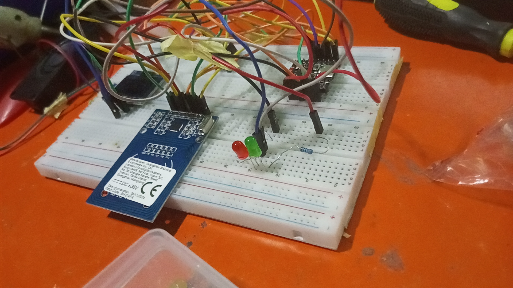

# IoT Smart RFID Attendance System (ESP32-C3 & Google Sheets)

An automated, cloud-connected attendance logging system built using an **ESP32-C3** microcontroller, an **MFRC522 RFID module**, and an **SSD1306 OLED display**. The device offloads database heavy lifting to the cloud using **Google Apps Script**, allowing the system to scale seamlessly to handle any number of students without running out of hardware memory.

## 🚀 How It Works
1. A student taps their RFID token on the reader.
2. The ESP32-C3 captures the raw UID and securely transmits it via an HTTP GET request to a Google Web App API.
3. The serverless **Google Apps Script** catches the ID, dynamically searches a `Roster` spreadsheet database, logs a live timestamped record to the `Attendance` sheet, and relays the student's name back to the device.
4. The ESP32-C3 reads the dynamic text response, blinks the indicator status LEDs, triggers a success chime on the buzzer, and centers the student's real name onto the OLED screen.

## 🛠️ Hardware Components
* **Microcontroller:** ESP32-C3
* **RFID Reader:** MFRC522 (SPI Interface)
* **Display:** 128x64 SSD1306 I2C OLED
* **Indicators:** Status LEDs (Green/Red) and a Active Piezo Buzzer

## 📊 Cloud Database Architecture
The connected Google Spreadsheet utilizes two structured tabs to break down data processing cleanly:
* **`Roster`:** Database column tracking (`Card ID` | `Student Name`). Scale-independent lookup structure using dynamic row lengths.
* **`Attendance`:** Live running logs table tracking (`Timestamp` | `Card ID` | `Student Name`).

## 💻 Tech Stack
* **Firmware:** C++ (Arduino Core)
* **Cloud API Architecture:** JavaScript (Google Apps Script Engine)
* **Communication Protocol:** HTTP/HTTPS REST API Client
* ## 🔌 Hardware Pinout Configuration

The system uses the standard ESP32 module. The components are wired directly to the GPIO pins as mapped below:

| Component | Component Pin | ESP32 GPIO Pin | Description |
| :--- | :--- | :--- | :--- |
| **MFRC522 RFID** | SDA (SS) | **GPIO 5** | SPI Chip Select |
| | SCK | **GPIO 4** | SPI Clock |
| | MOSI | **GPIO 6** | SPI Master Out Slave In |
| | MISO | **GPIO 7** | SPI Master In Slave Out |
| | RST | **GPIO 3** | Reset Pin |
| | 3.3V | **3.3V** | Power Supply |
| | GND | **GND** | Ground |
| **SSD1306 OLED** | SDA | **GPIO 8** | I2C Data Line |
| | SCL | **GPIO 9** | I2C Clock Line |
| | VCC | **3.3V / 5V** | Power Supply |
| | GND | **GND** | Ground |
| **Status LEDs** | Green LED (+) | **GPIO 10** | Success Indicator |
| | Red LED (+) | **GPIO 1** | Failure/Error Indicator |
| **Audio Alert** | Buzzer (+) | **GPIO 2** | Piezo Audio Chime |

---

## 📸 Project Media & Demo

### 🛠️ Hardware Prototype
Here is the physical layout wired up on the breadboard:

  

---

### 🎥 Live Demonstration
Below is the video demonstration showing the real-time card scanning, hardware alerts, and cloud data logging:

  <video src="https://github.com/drasca-pel/ESP32-RFID-Attendance-System/blob/main/VID-20260703-WA0101.mp4?raw=true" controls width="600" poster="IMG_20260703_214258_4.jpg">
    Your browser does not support the video tag.
  </video>

